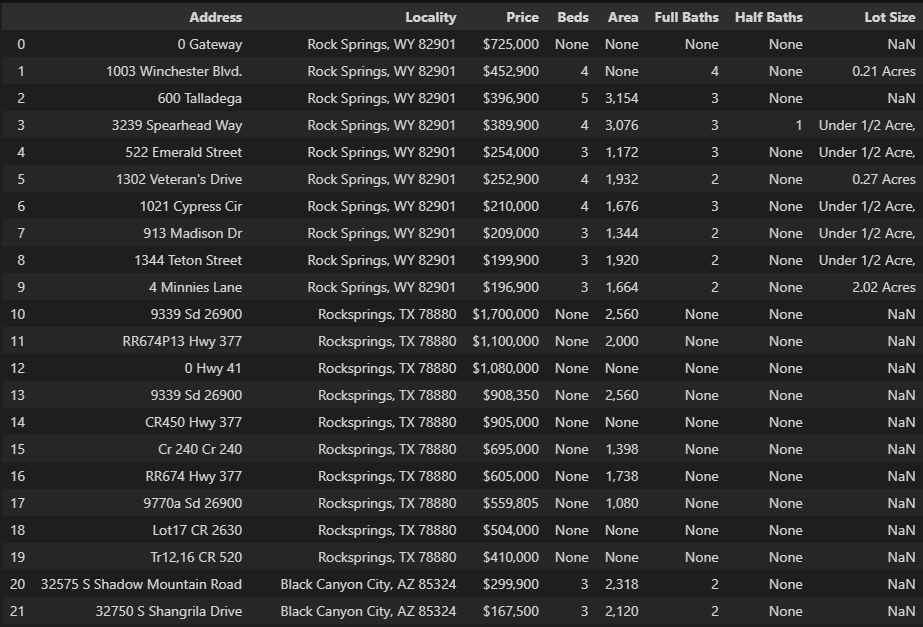

# Python-Web-Scrapping

This program uses scrapes information from a webpage and outputs the data to a csv file. 
The main objective was to excercise the use of the BeautifulSoup library in scraping a webpage.
The data extarcted is then converted into a pandas dataframe from which is then written into a csv file.

 
